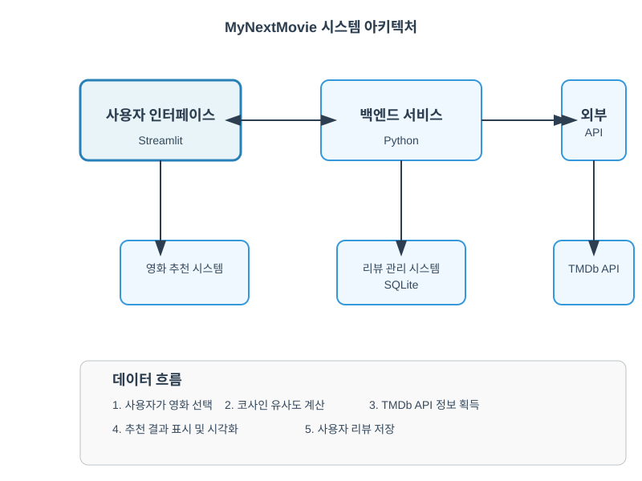

# MyNextMovie

영화 추천 및 리뷰 시스템을 제공하는 웹 애플리케이션입니다.

## 프로젝트 개요

MyNextMovie는 사용자가 좋아하는 영화를 선택하면 유사한 영화를 추천해주는 서비스입니다. 코사인 유사도를 기반으로 영화 추천 알고리즘을 구현했으며, 사용자는 영화에 대한 리뷰와 평점을 남길 수 있습니다.

## 주요 기능

1. **영화 추천**: 선택한 영화와 유사한 10개의 영화를 추천
2. **영화 검색**: 영화 제목으로 검색 기능
3. **리뷰 시스템**: 영화에 대한 평점과 리뷰 작성 및 관리
4. **시각화**: 추천 영화의 유사도를 막대 그래프와 원형 그래프로 시각화

## 시스템 구조

```
MyNextMovie/
├── app.py                 # 메인 애플리케이션 코드
├── movies.pickle          # 전처리된 영화 데이터
├── cosine_sim.pickle      # 코사인 유사도 매트릭스
├── movies.db              # SQLite 데이터베이스 (리뷰 저장)
├── images/                # 이미지 파일 디렉토리
├── .env                   # 환경 변수 파일 (API 키 저장)
├── venv/                  # 가상환경
└── requirements.txt       # 필요한 패키지 목록
```

## 시스템 다이어그램



다이어그램 코드:
- [시스템 다이어그램](images/system_diagram.mmd)
- [시퀀스 다이어그램](images/sequence_diagram.puml)

### 시스템 구성 요소

- **사용자 인터페이스(Streamlit)**: 사용자와 상호작용하는 웹 인터페이스
- **백엔드 서비스(Python)**: 영화 추천 알고리즘 및 데이터 처리 로직
- **외부 API(TMDb)**: 영화 정보 및 이미지를 제공하는 외부 서비스
- **데이터베이스(SQLite)**: 사용자 리뷰 및 평점 데이터 저장

### 작동 과정
1. 사용자가 영화를 선택하면 백엔드에서 코사인 유사도를 계산합니다
2. 계산된 유사도를 기반으로 가장 유사한 영화 목록을 생성합니다
3. TMDb API를 통해 추천된 영화들의 상세 정보를 가져옵니다
4. 계산된 결과를 시각화하여 사용자에게 보여줍니다
5. 사용자는 영화에 대한 리뷰를 작성하고 평점을 매길 수 있습니다

## 데이터 흐름

1. 사용자가 영화 선택
2. 코사인 유사도 매트릭스를 통해 유사 영화 추출
3. TMDb API를 통해 영화 상세 정보 및 포스터 이미지 가져오기
4. 추천 결과 표시 및 시각화
5. 사용자 리뷰 데이터는 SQLite 데이터베이스에 저장

## 설치 및 실행 방법

1. 저장소 클론
   ```
   git clone <repository-url>
   cd MyNextMovie
   ```

2. 가상환경 설정
   ```
   # Windows
   python -m venv venv
   venv\Scripts\activate

   # macOS/Linux
   python -m venv venv
   source venv/bin/activate
   ```

3. 필요한 패키지 설치
   ```
   pip install -r requirements.txt
   ```

4. 환경 변수 설정
   `.env` 파일을 생성하고 TMDB API 키 설정
   ```
   TMDBAPI=your_api_key_here
   ```

5. 애플리케이션 실행
   ```
   streamlit run app.py
   ```

## TMDb API 키 획득 방법

1. [TMDb 웹사이트](https://www.themoviedb.org/)에 가입
2. 설정 > API에서 API 키 발급
3. 발급받은 키를 `.env` 파일에 저장

## 기술 스택

- **프론트엔드**: Streamlit
- **백엔드**: Python
- **데이터베이스**: SQLite
- **데이터 분석**: Pandas, NumPy
- **시각화**: Altair, Plotly
- **외부 API**: TMDb API 